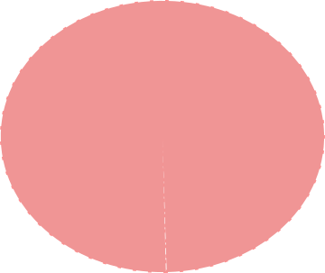

background-image: url(https://upload.wikimedia.org/wikipedia/commons/b/be/Sharingan_triple.svg)

```{r setup, include=FALSE}
options(htmltools.dir.version = FALSE)
```

???

Image credit: [Wikimedia Commons](https://commons.wikimedia.org/wiki/File:Sharingan_triple.svg)

---
---
class: inverse
name: pull-demo

.left-column[
Momtocat on your left


]
.right-column[
Poptocat on your right


]

--

.footnote[
[1] On a full slide, these are each 47% width.

[2] You can also similarly use `.left-column[]` and `.right-column[]`. The sizes are then 20% and 75%, respectively.
]


---
.pull-right[

.acid[Output]

&lt;iframe src="https://arm.rbind.io/slides/xaringan.html#plot-last" width="100%" height="400px"&gt;&lt;/iframe&gt;


]
---


---
